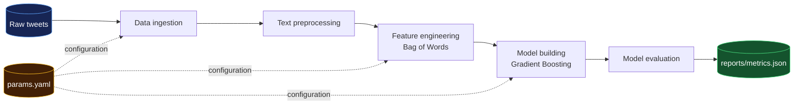

<div align="center">

# ML Pipeline with DVC

### From a notebook experiment to a reproducible machine learning system.

[](https://www.python.org/)
[](https://dvc.org/)
[](https://scikit-learn.org/)
[](LICENSE)

**An end-to-end NLP classification project focused on reproducibility, pipeline thinking, and practical MLOps foundations.**

[Explore the repository](https://github.com/Div7anshKushwaha/ML-Pipeline-DVC) · [View the pipeline file](dvc.yaml) · [Read the roadmap](#roadmap)

</div>

---

## The idea behind this project

> **The goal is not to build the perfect model. The goal is to understand how real machine learning projects are structured, reproduced, and improved.**

A model inside a notebook is only one part of a machine learning project. This repository focuses on the engineering layer around the model: versioned data, explicit dependencies, configurable parameters, reproducible stages, and trackable evaluation results.

This is the first step in an ongoing MLOps journey. The pipeline is intentionally simple so that the workflow is easy to inspect, reproduce, and extend with tools such as MLflow, Docker, and GitHub Actions.

## What is inside?

| Area | Implementation |
| --- | --- |
| Problem | Binary tweet sentiment classification |
| Text representation | Bag of Words with `CountVectorizer` |
| Model | Scikit-learn `GradientBoostingClassifier` |
| Pipeline orchestration | DVC |
| Configuration | `params.yaml` |
| Metrics | `reports/metrics.json` |
| Artifact tracking | DVC metadata and lock file |
| Code quality | Modular functions, type hints, logging, and exception handling |

## Pipeline at a glance



The complete workflow is defined in `dvc.yaml` and reproduced with:

```bash
dvc repro
```

DVC checks dependencies, parameters, outputs, and the lock file, then reruns only the stages affected by a change.

## The five stages

### 01 · Data ingestion

Loads the raw training and test data and writes the DVC-tracked files under `data/raw/`.

### 02 · Text preprocessing

Cleans the tweet text by lowercasing it, removing URLs and mentions, removing hashtag symbols and non-alphabetic characters, normalizing whitespace, and dropping empty records.

### 03 · Feature engineering

Transforms the cleaned text into numerical features with Scikit-learn's `CountVectorizer`. The vectorizer is fitted only on the training data before being applied to the test data, which prevents test-set vocabulary leakage.

### 04 · Model building

Trains a `GradientBoostingClassifier` and stores the generated model at:

```
models/model.pkl
```

### 05 · Model evaluation

Calculates accuracy, precision, recall, and ROC-AUC. The results are written to:

```
reports/metrics.json
```

## Current experiment snapshot

These values are a snapshot of the current run. They are included to demonstrate metric tracking, not to claim a production-ready model.

| Metric | Score |
| --- | --- |
| Accuracy | **0.6578** |
| Precision | **0.6697** |
| Recall | **0.9031** |
| ROC-AUC | **0.6549** |

The model can be improved later through better preprocessing, feature representations, model selection, hyperparameter tuning, and validation strategies. For this project, the reproducible workflow is the primary result.

## Repository structure

```
ML-Pipeline-DVC/
├── .dvc/                         # DVC configuration
├── docs/                         # Project documentation source files
├── notebooks/                    # Reserved for exploratory notebooks
├── references/                   # Reserved for reference material
├── reports/
│   ├── figures/                  # Reserved for generated visualizations
│   └── metrics.json              # Evaluation metrics
├── src/
│   ├── data/
│   │   ├── data_ingestion.py     # Data ingestion stage
│   │   └── data_preprocessing.py # Text cleaning stage
│   ├── features/
│   │   └── feature_engineering.py
│   ├── models/
│   │   ├── model_building.py     # Model training stage
│   │   └── model_evaluation.py   # Evaluation stage
│   └── visualization/            # Reserved for visualization code
├── data/                         # DVC-generated data artifacts
├── models/                       # DVC-generated model artifacts
├── dvc.yaml                      # Pipeline stages and dependencies
├── dvc.lock                      # Locked pipeline state
├── params.yaml                   # Experiment parameters
├── requirements.txt              # Python dependencies
├── setup.py                      # Package configuration
├── Makefile                      # Project utility commands
├── test_environment.py           # Environment test
├── tox.ini                       # Tox configuration
├── .dvcignore
├── .gitignore
├── LICENSE
└── README.md
```

The source tree and configuration files are committed to Git. The `data/` and `models/` directories contain artifacts generated by the DVC pipeline and may not appear as populated directories in the GitHub tree until the pipeline is executed.

## Quick start

### 1. Clone the repository

```bash
git clone https://github.com/Div7anshKushwaha/ML-Pipeline-DVC.git
cd ML-Pipeline-DVC
```

### 2. Create a virtual environment

**macOS / Linux**

```bash
python3 -m venv venv
source venv/bin/activate
```

**Windows**

```bash
python -m venv venv
venv\\Scripts\\activate
```

### 3. Install the project

```bash
pip install -r requirements.txt
pip install dvc
```

You can also install the package in editable mode:

```bash
pip install -e .
```

### 4. Reproduce the pipeline

```bash
dvc repro
```

### 5. Inspect the result

```bash
dvc metrics show
dvc dag
dvc status
```

## Experiment with parameters

The pipeline parameters live in `params.yaml`:

```yaml
data_ingestion:
  test_size: 0.2

feature_engineering:
  max_features: 50

model_building:
  learning_rate: 0.1
  n_estimators: 100
```

Change a parameter without touching the Python source code:

```yaml
model_building:
  learning_rate: 0.05
  n_estimators: 200
```

Then reproduce the workflow:

```bash
dvc repro
dvc metrics show
```

Compare results across Git revisions with:

```bash
dvc metrics diff
```

## Useful commands

| Command | What it does |
| --- | --- |
| `dvc repro` | Reproduces the pipeline and reruns changed stages |
| `dvc dag` | Displays the pipeline dependency graph |
| `dvc metrics show` | Shows the current evaluation metrics |
| `dvc metrics diff` | Compares metrics between revisions |
| `dvc status` | Checks whether the pipeline is up to date |
| `dvc push` | Uploads artifacts after a DVC remote is configured |
| `dvc pull` | Downloads artifacts from a configured DVC remote |

> **Note:** A DVC remote is not configured yet. `dvc push` and `dvc pull` will become part of the workflow after a remote storage location is added.

## Reproducibility loop

```
Change params.yaml
       ↓
Run dvc repro
       ↓
Review reports/metrics.json
       ↓
Run dvc metrics diff
       ↓
Commit the experiment to Git
```

This loop makes it possible to understand what changed, reproduce previous states, and compare experiments without manually managing generated files.

## Roadmap

This project will grow in stages:

- [ ] Configure a DVC remote for shared artifacts

- [ ] Add MLflow experiment tracking

- [ ] Add unit and integration tests

- [ ] Add data and model validation

- [ ] Dockerize the training and serving environments

- [ ] Add GitHub Actions CI/CD

- [ ] Build a model-serving API

- [ ] Deploy the service to the cloud

- [ ] Add monitoring and drift detection

- [ ] Compare additional models and feature representations

## Takeaway

The most important lesson from this project is simple:

> **Machine learning engineering is not only about training a model. It is about building a system that others can reproduce, inspect, maintain, and improve.**

This repository is a foundation, not a finished product. Every future improvement—better experiments, stronger validation, automated deployment, and monitoring—will build on the same reproducible pipeline.

## Author

**Divyansh Kushwaha**
BS in Data Science and Applications, IIT Madras

- GitHub: [@Div7anshKushwaha](https://github.com/Div7anshKushwaha)

- Repository: [ML-Pipeline-DVC](https://github.com/Div7anshKushwaha/ML-Pipeline-DVC)

## License

This project is licensed under the MIT License. See [LICENSE](LICENSE) for details.

## References

[1]: https://dvc.org/doc "DVC Documentation"

[2]: https://scikit-learn.org/stable/ "Scikit-learn Documentation"

[3]: https://docs.python.org/3/ "Python Documentation"

[4]: https://pandas.pydata.org/docs/ "Pandas Documentation"

[1]: # "[2] [3] [4]"